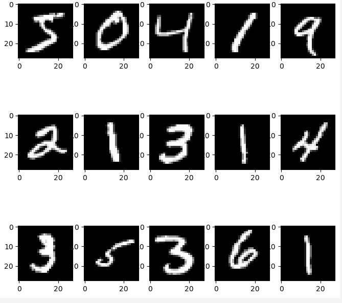
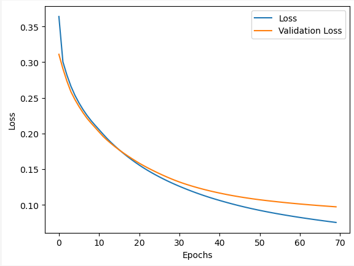
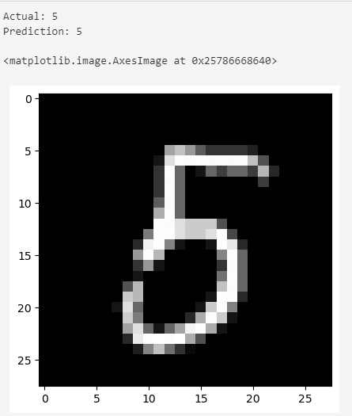
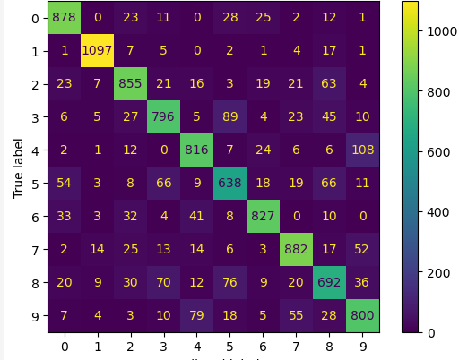

# Digit Classification using Custom Neural Network (Numpy & Python)

This is classification of digits using a custom neural network implementation.

## Metrics

Training Loss: 8%
Testing Loss: 10%

## Dataset

## Loss

## Prediction

## Confusion Matrix

